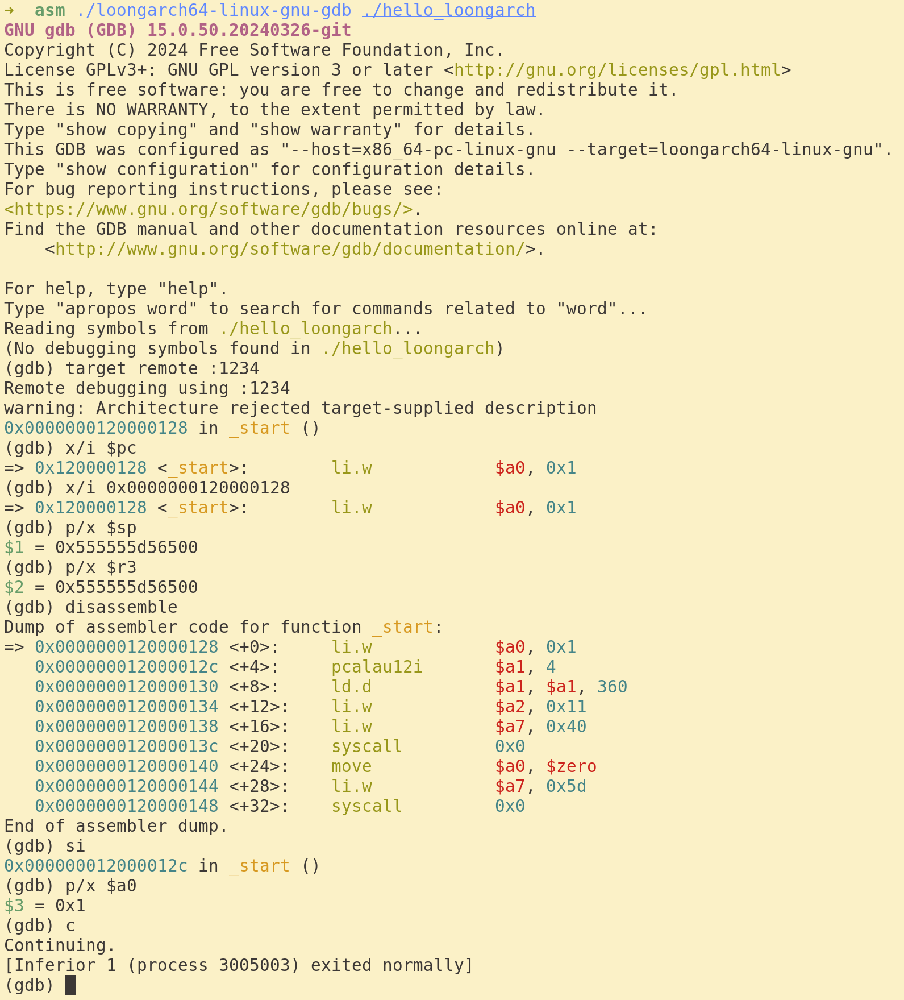

## 搭建 LoongArch 汇编实验环境 (Linux)

### 编译安装qemu-loongarch64

#### 可以从[https://github.com/rrwhx/qemu_bin](https://github.com/rrwhx/qemu_bin)直接下载编译好的文件

1. 下载[这里](https://download.qemu.org/qemu-8.2.2.tar.xz)QEMU源码

```bash
wget https://download.qemu.org/qemu-8.2.2.tar.xz
tar -xf qemu-8.2.2.tar.xz
```
或者
```bash
git clone https://gitlab.com/qemu-project/qemu.git
```

2. 安装依赖
```bash
sudo apt-get install -y make ninja-build gcc pkg-config libglib2.0-dev git python3-venv
```

3. 编译QEMU
```bash
cd qemu && mkdir build && cd build
../configure --target-list=loongarch64-linux-user
ninja
./qemu-loongarch64 --version
# qemu-loongarch64 version 8.2.2
# Copyright (c) 2003-2023 Fabrice Bellard and the QEMU Project developers
```

### 下载loongarch-gcc交叉工具链

从[这里](https://github.com/sunhaiyong1978/CLFS-for-LoongArch/releases/download/8.1/CLFS-loongarch64-8.1.1-x86_64-cross-tools-gcc-libc.tar.xz)下载压缩包，并解压

```bash
wget https://github.com/sunhaiyong1978/CLFS-for-LoongArch/releases/download/8.1/CLFS-loongarch64-8.1.1-x86_64-cross-tools-gcc-libc.tar.xz
tar -xf CLFS-loongarch64-8.1.1-x86_64-cross-tools-gcc-libc.tar.xz
./cross-tools/bin/loongarch64-unknown-linux-gnu-gcc --version
# loongarch64-unknown-linux-gnu-gcc (GCC) 13.2.0
# Copyright (C) 2023 Free Software Foundation, Inc.
# This is free software; see the source for copying conditions.  There is NO
# warranty; not even for MERCHANTABILITY or FITNESS FOR A PARTICULAR PURPOSE.
```

### 编写测试

编写 hello_loongarch.S

```asm
# LoongArch Assembler program to print "Hello World!"
# to stdout.
#
# a0-a2 - parameters to linux syscall services
# a7 - linux syscall number
#

.global _start      # Provide program starting address to linker

# Setup the parameters to print hello world
# and then call Linux to do it.

_start:

        li.d  $a0, 1          # 1 = StdOut
        la    $a1, helloworld # load address of helloworld
        li.d  $a2, 17         # length of our string
        li.d  $a7, 64         # linux write system call
        syscall 0             # Call linux to output the string

# Setup the parameters to exit the program
# and then call Linux to do it.

        li.d    $a0, 0       # Use 0 return code
        li.d    $a7, 93      # Service command code 93 terminates
        syscall 0            # Call linux to terminate the program

.data
helloworld:      .ascii "Hello LoongArch!\n"
```

### 编译测试

```bash
./cross-tools/bin/loongarch64-unknown-linux-gnu-gcc -nostdlib -static hello_loongarch.S -o ./hello_loongarch
```

### 运行测试

```bash
./qemu-8.2.2/build/qemu-loongarch64 ./hello_loongarch
# Hello LoongArch!
```

### 参考资料

* LongArch指令集手册[https://github.com/loongson/LoongArch-Documentation/releases/latest/download/LoongArch-Vol1-v1.10-CN.pdf](https://github.com/loongson/LoongArch-Documentation/releases/latest/download/LoongArch-Vol1-v1.10-CN.pdf)
* LoongArch ABI[https://loongson.github.io/LoongArch-Documentation/LoongArch-ELF-ABI-CN.html](https://loongson.github.io/LoongArch-Documentation/LoongArch-ELF-ABI-CN.html)
* LoongArch 汇编参考[https://github.com/loongson/la-asm-manual/releases/download/draft/la-asm-manual.pdf](https://github.com/loongson/la-asm-manual/releases/download/draft/la-asm-manual.pdf)
* QEMU[https://www.qemu.org/](https://www.qemu.org/)

### 使用qemu和gdb调试loongarch64程序

1. 下载`loongarch64-linux-gnu-gdb` [https://github.com/rrwhx/qemu_bin/blob/main/loongarch64-linux-gnu-gdb](https://github.com/rrwhx/qemu_bin/blob/main/loongarch64-linux-gnu-gdb), 也可以自己从源码编译[https://www.gnu.org/software/binutils/](https://www.gnu.org/software/binutils/)

2. 使用qemu运行loongarch64程序，加上`-g 1234`选项以在`1234`端口启动gdbserver
```bash
./qemu-8.2.2/build/qemu-loongarch64 -g 1234 ./hello_loongarch
```

3. 使用gdb调试, 运行`./loongarch64-linux-gnu-gdb ./hello_loongarch`开始调试，输入`target remote :1234`连接到gdbserver。

   


| 命令               | 说明 |
| --------          | ------- |
| r                 |   开始运行  |
| c                 | 继续运行     |
| b  addr           | 设置断点    |
| i registers       | 显示寄存器的值    |
| x addr            | 显示内存的值    |
| x/i addr          | 以指令方法显示内存的值    |
| si                | 执行一条指令    |
| print expression  | 打印表达式的值    |

### gdb参考资料
* GDB Cheat Sheet [https://bytes.usc.edu/cs104/wiki/gdb/](https://bytes.usc.edu/cs104/wiki/gdb/)
* GDB Cheat Sheet [https://github.com/skywind3000/awesome-cheatsheets/blob/master/tools/gdb.txt](https://github.com/skywind3000/awesome-cheatsheets/blob/master/tools/gdb.txt)
* 详细的参考[https://visualgdb.com/gdbreference/commands/](https://visualgdb.com/gdbreference/commands/)
